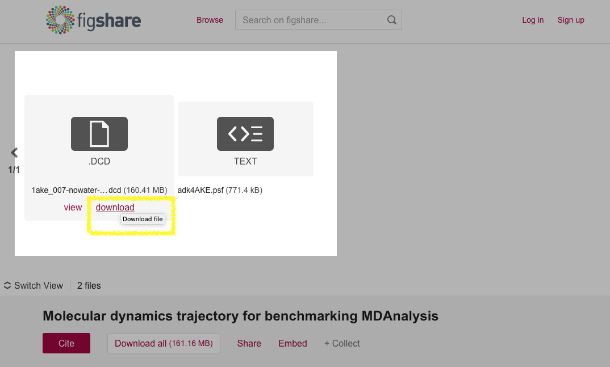

.. -*- coding: utf-8 -*-
.. _contributing:

===========================
 Contributing new datasets
===========================

New datasets are very welcome and everybody is encouraged to make their
datasets accessible via :mod:`MDAnalysisData`, regardless of the simulation
package or analysis code that they use. Users are encouraged to cite the
authors of the datasets.

:mod:`MDAnalysisData` does *not* store files and trajectories. Instead, it
provides accessor code to seamlessly download (and cache) files from archives.

Outline
=======

When you contribute data then you have to do two things

1. **deposit data in an archive** under an `Open Data`_ compatible license
   (`CC0`_ or `CC-BY`_ preferred)
2. **write accessor code** in :mod:`MDAnalysisData`

   The accessor code needs the stable archive URL(s) for your files and SHA256
   checksums to check the integrity for any downloaded files. You will also add
   a description of your dataset.

.. note::

    We currently have code to work with the `figshare`_ archive so choosing
    *figshare* will be easiest. But it should be straightforward to add code to
    work with other archive-grade repositories such as `zenodo`_ or
    `DataDryad`_. Some universities also provide digital repositories that are
    suitable. Open an issue in the `Issue Tracker`_ for supporting other
    archives.
   

Step-by-step instructions
=========================

To add a new dataset deposit your data in a repository. Then open a *pull
request* for the https://github.com/MDAnalysis/MDAnalysisData
repository. Follow these steps:

STEP 1: Archival deposition
---------------------------

Deposit *all* required files in an archive-grade repository such as
`figshare`_.

.. Note::

   The site must *provide stable download links* and *may not change the
   content during download* because we store a SHA256 :ref:`checksum<checksum>`
   to check file integrity.

Make sure to **choose an** `Open Data`_ **compatible license** such as CC0_ or
`CC-BY`_.

Take note of the **direct download URL** for each of your files. It should be
possible to obtain the file directly from a stable URL with :program:`curl` or
:program:`wget`. As an example look at the dataset for
:mod:`MDAnalysisData.adk_equilibrium` at DOI `10.6084/m9.figshare.5108170`_ (as
shown in the :ref:`figure below<fig-figshare-adk>`). Especially note the
*download* links of the DCD trajectory
(https://ndownloader.figshare.com/files/8672074) and PSF topology files
(https://ndownloader.figshare.com/files/8672230) as these links will be needed
in the accessor code in :mod:`MDAnalysisData` in the next step.

.. _fig-figshare-adk:

   The AdK Equilbrium dataset on figshare DOI `10.6084/m9.figshare.5108170`_,
   highlighting the deposited trajectory and topology files. The *download*
   URLs are visible when hovering over a file's image.

.. _`10.6084/m9.figshare.5108170`:
   https://doi.org/10.6084/m9.figshare.5108170

STEP 2: Add code and docs to MDAnalysisData
-------------------------------------------

1. Add a Python module ``{MODULE_NAME}.py`` with the name of your dataset
   (where ``{MODULE_NAME}`` is just a placeholder). As an example see
   `MDAnalysisData/adk_equilibrium.py`_, which becomes
   :mod:`MDAnalysisData.adk_equilibrium`). In many cases you can copy an
   existing module and adapt:
   
   - text: describe your dataset
   - :data:`NAME`: name of the data set; will be used as a file name so do not use spaces etc
   - :data:`DESCRIPTION`: filename of the description file (which contains
     restructured text format, so needs to have suffix ``.rst``)
   - :data:`ARCHIVE`: dictionary containing
     :class:`~MDAnalysisData.base.RemoteFileMetadata` instances. Keys should
     describe the file type. Typically

     - *topology*: topology file (PSF, TPR, ...)
     - *trajectory*: trajectory coordinate file (DCD, XTC, ...)
     - *structure* (optional): system with single frame of coordinates
       (typically PDB, GRO, CRD, ...)
	  
   - name of the :func:`fetch_{NAME}` function (where ``{NAME}`` is a suitable
     name to access your dataset)
   - docs of the :func:`fetch_{NAME}` function
   - calculate and store the reference :ref:`SHA256 checksum <checksum>` as
     described below
     
2. Add a description file (example:
   `MDAnalysisData/descr/adk_equilibrium.rst`_); copy an existing file and
   adapt. **Make sure to add license information.**
3. Import your :func:`fetch_{NAME}` function in
   `MDAnalysisData/datasets.py`_. ::

      from .{MODULE_NAME} import fetch_{NAME}
     
4. Add documentation ``{NAME}.rst`` in restructured text format under `docs/`_
   (take existing files as examples) and append ``{NAME}`` to the second
   ``toctree`` section of the `docs/index.rst`_ file.

   .. code-block:: reST

      .. toctree::
	 :maxdepth: 1
	 :caption: Datasets
	 :hidden:

	 adk_equilibrium
	 adk_transitions
	 ...
	 CG_fiber		   
         {NAME}
	 
If your data set does not follow the same pattern as the example above (where
each file is downloaded separately) then you have to write your own
:func:`fetch_{NAME}` function. E.g., you might download a tar file and then
unpack the file yourself. Use scikit-learn's `sklearn/datasets`_ as examples,
make sure that your function sets appropriate attributes in the returned
:class:`~MDAnalysisData.base.Bunch` of records, and fully document what is
returned.

.. _checksum:

RemoteFileMetadata and SHA256 checksum
======================================

The :class:`~MDAnalysisData.base.RemoteFileMetadata` is used by
:func:`~MDAnalysisData.base._fetch_remote` and it will check file integrity by
computing a SHA256 checksum over each downloaded file with a stored reference
checksum. **You must compute the reference checksum and store it in your**
:class:`~MDAnalysisData.base.RemoteFileMetadata` data structure for each file.

Typically you will have a local copy of the files during testing. You can
compute the SHA256 for a file ``FILENAME`` with the following code::

  python import MDAnalysisData.base
  print(MDAnalysisData.base._sha256(FILENAME))

or from the commandline

.. code-block:: bash

   python -c 'import MDAnalysisData; print(MDAnalysisData.base._sha256("FILENAME"))'

where ``FILENAME`` is the file that is stored in the archive.

.. references

.. _`Open Data`: https://opendatacommons.org/
.. _CC0: https://creativecommons.org/share-your-work/public-domain/cc0
.. _CC-BY: https://creativecommons.org/licenses/by/4.0/
.. _figshare: (https://figshare.com/
.. _zenodo: https://zenodo.org/
.. _DataDryad: https://www.datadryad.org/
.. _`Issue Tracker`: https://github.com/MDAnalysis/MDAnalysisData/issues
.. _`MDAnalysisData/adk_equilibrium.py`:
   https://github.com/MDAnalysis/MDAnalysisData/blob/master/MDAnalysisData/adk_equilibrium.py
.. _`MDAnalysisData/descr/adk_equilibrium.rst`:
   https://github.com/MDAnalysis/MDAnalysisData/blob/master/MDAnalysisData/descr/adk_equilibrium.rst
.. _`MDAnalysisData/datasets.py`:
   https://github.com/MDAnalysis/MDAnalysisData/blob/master/MDAnalysisData/datasets.py
.. _`docs/`:
   https://github.com/MDAnalysis/MDAnalysisData/blob/master/docs/
.. _`docs/index.rst`:
   https://github.com/MDAnalysis/MDAnalysisData/blob/master/docs/index.rst
.. _`sklearn/datasets`:
   https://github.com/scikit-learn/scikit-learn/tree/master/sklearn/datasets
